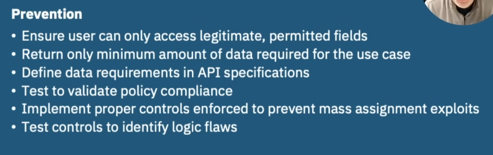
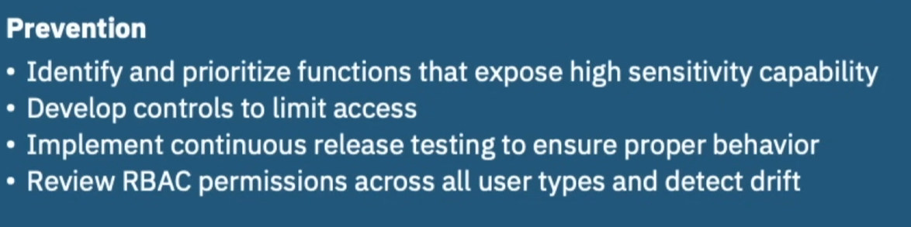
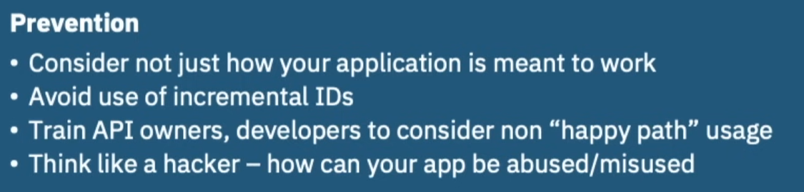
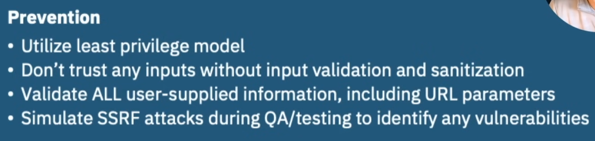

## OWASP API Top 10 (2023)
### Broken Object Level Authentication (BOLA)
An application or API fails to verify if a logged-in user has permission to access a specific data object (like a user profile, order, or file), allowing attackers to manipulate object IDs in requests (e.g., changing /orders/123 to /orders/124) to view, modify, or delete other users' sensitive data

Examples:
* [Coinbase - Change product id from Ethereum to Bitcoin](https://salt.security/blog/understanding-the-coinbase-api-vulnerability)

* [Peleton - No Authorization check for accessing all user info](https://salt.security/blog/the-peloton-api-security-incident-what-happened-and-how-you-can-protect-yourself)

#### Preventive Measures
1. Discuss Authorization rules during API design phase
2. Review Business requirements and define data access policies
3. Enforce Authorization controls at application logic layer
4. Implement Automated, pre-production testing to find BOLA flaws

### Broken Authentication
Vulnerability due to weak or poor authentication. Happens due to poor design, like weak passwords, insecure session tokens (e.g., predictable IDs, unencrypted transmission), or flawed password recovery, allowing attackers to bypass security via techniques like brute-forcing, credential stuffing, or session hijacking. 

Example:
* [Duolingo - Users Email and Names exposed due to non authenticated api](https://heimdalsecurity.com/blog/duolingo-data-breach/)

#### Preventive Measures
1. Define Authentication policies based on business requirements
2. Consider data sensitivity in policies
3. Implement continous testing to identify gaps weaknesses
4. Don't assume APIs are hidden/won't be found. LOCK THE DOOR!!!

### Broken Object Property Level Authorization
Exploit of endpoints by reading and/or modifying values of objects.
1. Mass assignment: Ability to update
User is able to set `account-type=premium`
2. Excess data exposoure
Api returns excessive, unnecessary details like address, bank account info etc.

Example:
* Venmo data scraping - Dan Salmon - I Scarped Millions of Venmo Payments. Your Data is at risk

Best Practice - Data Minimization

Prevention

### Unrestricted Resource Consumption
### Broken Function Level Authorization

### Unrestricted Access to Sensitive Business Flow

### Server Side Request Forgery

### Server Misconfiguration

### Improper Inventory Management

### Unsafe Consumption of APIs
