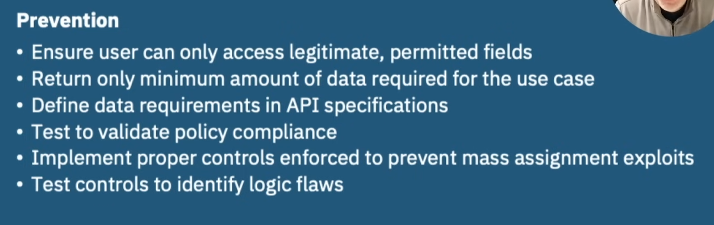
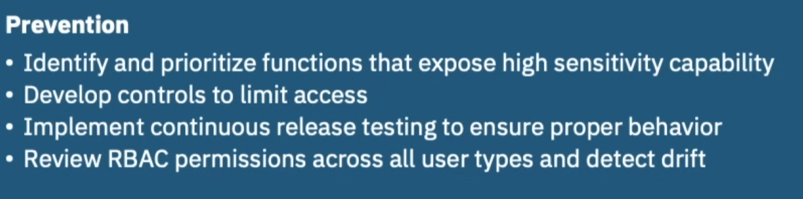
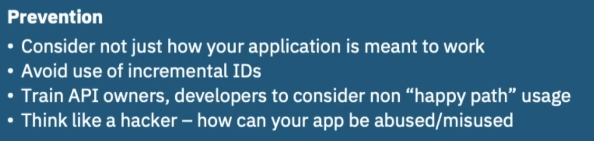
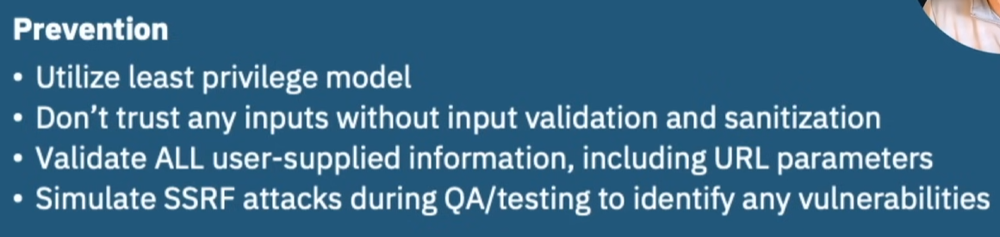

## OWASP API Top 10 (2023)
### Broken Object Level Authentication (BOLA)
An application or API fails to verify if a logged-in user has permission to access a specific data object (like a user profile, order, or file), allowing attackers to manipulate object IDs in requests (e.g., changing /orders/123 to /orders/124) to view, modify, or delete other users' sensitive data

Examples:
* [Coinbase - Change product id from Ethereum to Bitcoin](https://salt.security/blog/understanding-the-coinbase-api-vulnerability)

* [Peleton - No Authorization check for accessing all user info](https://salt.security/blog/the-peloton-api-security-incident-what-happened-and-how-you-can-protect-yourself)

#### Preventive Measures
1. Discuss Authorization rules during API design phase
2. Review Business requirements and define data access policies
3. Enforce Authorization controls at application logic layer
4. Implement Automated, pre-production testing to find BOLA flaws

### Broken Authentication
Vulnerability due to weak or poor authentication. Happens due to poor design, like weak passwords, insecure session tokens (e.g., predictable IDs, unencrypted transmission), or flawed password recovery, allowing attackers to bypass security via techniques like brute-forcing, credential stuffing, or session hijacking. 

Example:
* [Duolingo - Users Email and Names exposed due to non authenticated api](https://heimdalsecurity.com/blog/duolingo-data-breach/)

#### Preventive Measures
1. Define Authentication policies based on business requirements
2. Consider data sensitivity in policies
3. Implement continous testing to identify gaps weaknesses
4. Don't assume APIs are hidden/won't be found. LOCK THE DOOR!!!

### Broken Object Property Level Authorization
Exploit of endpoints by reading and/or modifying values of objects.
1. Mass assignment: Ability to update
User is able to set `account-type=premium`
2. Excess data exposoure
Api returns excessive, unnecessary details like address, bank account info etc.

Example:
* Venmo data scraping - Dan Salmon - I Scarped Millions of Venmo Payments. Your Data is at risk

Best Practice - Data Minimization

Prevention

### Unrestricted Resource Consumption
An API allows clients to consume excessive compute, memory, bandwidth, or storage without any effective limit. Attackers can trigger expensive actions repeatedly, upload large payloads, or abuse retries and loops to exhaust system resources and cause outages.

Example:
* Repeated calls to an endpoint that generates large reports or exports data for every user
* Uploading huge files or sending many requests to force CPU, memory, or database exhaustion

#### Preventive Measures
1. Enforce rate limiting, quotas, and concurrency limits per user or API key
2. Set strict payload, file size, and timeout limits
3. Cache expensive responses and offload heavy tasks to background jobs
4. Monitor usage patterns and alert when resource spikes occur

### Broken Function Level Authorization
Authorization checks are missing or not enforced correctly at the function or action level. An attacker may access privileged endpoints simply by guessing URL patterns or invoking admin-like actions with a normal user account.

Example:
* A non-admin user calls `/api/admin/deleteUser` or `/api/users/{id}/resetPassword`
* A standard customer account accesses billing or reporting functions outside their role scope

#### Preventive Measures
1. Apply authorization checks to every function and action, not just login or resource access
2. Use role-based or attribute-based access control consistently
3. Restrict admin endpoints to trusted roles and networks
4. Run authorization testing to detect both horizontal and vertical privilege escalation

### Unrestricted Access to Sensitive Business Flow
Some business workflows are not protected against abuse, allowing attackers to trigger sensitive actions without the proper approval, verification, or sequencing checks. This often turns into business logic abuse rather than direct technical exploits.

Example:
* Users repeatedly create discount codes or exploit price-check logic to receive free or heavily discounted products
* An attacker triggers a high-value transaction without completing the required approval or verification process

#### Preventive Measures
1. Identify critical business workflows and define required controls for each step
2. Enforce workflow-level checks like approval, verification, and transaction limits
3. Add anti-abuse protections such as rate limiting and anomaly detection
4. Review workflows for sequencing gaps and bypass opportunities early in design

### Server Side Request Forgery
An attacker can cause the server to make outbound requests to internal services, metadata endpoints, or arbitrary external resources by controlling a URL or request parameter. This can reveal internal network information or credentials.

Example:
* A request parameter like `http://localhost/admin` exposes internal admin pages
* The server calls `http://169.254.169.254/` and leaks cloud IAM credentials

#### Preventive Measures
1. Block access to localhost, private IP ranges, and cloud metadata endpoints
2. Use allowlists for destination domains and supported protocols
3. Validate and normalize all user-supplied URLs before making outbound requests
4. Reduce unnecessary outbound network access from application servers

### Server Misconfiguration
A server, framework, or API is misconfigured, exposing secure defaults, debug settings, sensitive stack traces, or unnecessary features. These misconfigurations often create an easy path for attackers to gather information or bypass controls.

Example:
* Debug mode enabled in production exposes stack traces, environment variables, or source code paths
* Default admin credentials remain active on an exposed management interface
* Misconfigured CORS allows arbitrary third-party websites to call the API

#### Preventive Measures
1. Use secure defaults and harden production configurations consistently
2. Disable debug mode, verbose errors, and unnecessary services in production
3. Apply TLS, secure headers, and least-privilege access controls
4. Review server and infrastructure settings regularly as part of security checks

### Improper Inventory Management
Organizations do not keep a complete and up-to-date inventory of all APIs, versions, and endpoints. Old, forgotten, or undocumented APIs often remain exposed and unpatched, creating a major security gap.

Example:
* A legacy `v1` API remains available after the new version goes live and exposes old data or weak auth
* A staging or testing API is accidentally left exposed to the internet
* Internal admin endpoints are published without being reviewed for security

#### Preventive Measures
1. Maintain a current inventory of all APIs, versions, owners, and deployment status
2. Retire deprecated APIs and remove unnecessary endpoints
3. Use automated discovery and monitoring to find undocumented services
4. Include API inventory review in the release and retirement lifecycle

### Unsafe Consumption of APIs
An application trusts external APIs or third-party data without validating it properly. This can lead to injection, broken logic, SSRF, data leakage, or unsafe downstream behavior when untrusted input is consumed.

Example:
* A webhook endpoint blindly trusts a payload and executes actions without validation
* An app accepts untrusted JSON and parses it without schema checks
* The system calls an external API using a user-controlled URL or headers without validation

#### Preventive Measures
1. Validate and sanitize all inputs from external APIs before processing them
2. Enforce strict schema validation and response checks
3. Authenticate and authorize API-to-API communication using secure credentials
4. Treat third-party APIs as untrusted and monitor for abuse or failures

### Broken Function Level Authorization

### Unrestricted Access to Sensitive Business Flow

### Server Side Request Forgery

